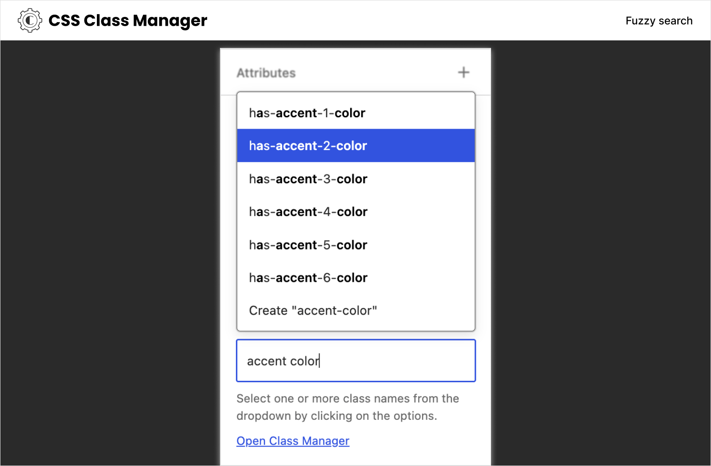

# CSS Class Manager

An advanced autocomplete additional css class control for your blocks

## Description

Struggling with adding multiple CSS classes to your WordPress blocks? CSS Class Manager simplifies the process with autocomplete suggestions and a dedicated manager for adding, editing, and organizing your classes. Boost your block styling efficiency!

There are two main motivations behind creating this plugins:

**Limitation of Block Style** - When applying a block style, only one CSS class can be added to a block. Unfortunately, the block editor lacks the ability to select multiple block styles. To address this, users must resort to the Additional CSS Class(es) inspector control to apply multiple classes. CSS Class Manager provides a powerful manager and an autocomplete inspector control, enabling users to easily add and apply CSS classes to their blocks.

**Poor UX of the Addional CSS Class(es) control** - The default control for adding class names is a simple text input. This can be cumbersome, especially when applying CSS classes frequently. With the custom inspector control provided by CSS Class Manager, users can effortlessly add their class names, enhancing the user experience.

## Features

- **Advanced Autocomplete Control:** Streamline block styling with autocomplete functionality for CSS classes.
- **Effortless Class Management:** Easily add, edit, or remove CSS classes directly within the manager interface.
- **Body and Post Classes:** Add custom class names to post body and post containers using body_class and post_class filters directly from the post editor.
- **Inline CSS Classes:** Add custom class names to any selected text inside paragraph, heading and other blocks that support Rich Text.
- **Theme.json Integration:** Automatically include global class names generated from theme.json settings in your class suggestions.
- **Show the control in its own panel:** User specific settings to show the Addional CSS Class(es) control in its own panel.
- **Add classes without saving to the database:** User specific settings to toggle saving classes to the database.
- **Import and Export:** Seamlessly transfer custom CSS class names to ensure consistency across projects.

## Getting Started

1. Activate the plugin within your WordPress setup.
2. The advanced control will replace the default "Additional CSS Class(es)" and can be found in the "Advance" block settings section.
3. Adding and selecting classes in the autocomplete field is similar to the tags and categories fields.
4. To add body or post classes, look for the "Body Classes" and "Post Classes" controls in the Post tab of the post editor (requires custom-fields support). [See the limitations](https://github.com/ediamin/css-class-manager/wiki/Known-Issues#body-classes-preview-in-block-editor)
5. To add inline classes to the selected text, use the block format tool control in the text formatting tools options (available in blocks that support Rich Text).
6. To edit and manage class names, click the "Open Class Manager" link or select "CSS Class Manager" from the More Menu.
7. Import/Export can be done from the manager modal.
8. Theme.json generated classes are automatically included and can be disabled from the Preferences in the manager modal.
9. Use `css_class_manager_filtered_class_names` filter to add class names with PHP files.

## Screenshots

1. The advanced inspector control is located in the Advanced block settings section.
	

2. Multi-select tag like input control instead of plain text field.
	

3. Add body classes to your posts, pages or custom post types with the Body Classes control located in the Post Tab in the post editor.
	

4. Add inline classes to the selected text from the text formatting tools options.
	

5. Fuzzy searching with fuse.js.
	

6. You can add your CSS classes and their descriptions in the CSS Class Manager modal.
	

7. Edit your CSS classes and their descriptions in the CSS Class Manager modal.
	

8. User-specific settings for the plugin.
	

9. Import or export your classes right from the manager modal.
	

## Frequently Asked Questions

### Where can I find the JavaScript and CSS non-compiled source files?
Please checkout the [GitHub repository](https://github.com/ediamin/css-class-manager) of this plugin to see the sources.

### How to open the manager modal?
Under the Additional CSS Class(es) control, you will see a link says Open Class Manager. Click on that to open the CSS Class Manager preferences modal.

### How do the Body Classes and Post Classes work?
The Body Classes control adds class names to the post's body element using WordPress's body_class filter, while Post Classes adds them to post containers using the post_class filter. These controls are available in the Post tab of the post editor and require the post type to support custom-fields.

### Can I disable theme.json generated classes?
Yes, you can disable theme.json generated class names from appearing in the dropdown by adjusting the preferences in the CSS Class Manager modal.

### How to use the PHP filter?
Use the `css_class_manager_filtered_class_names` filter to add your class names from your plugin or theme. Check out the example code in this [GitHub wiki page](https://github.com/ediamin/css-class-manager/wiki#how-to-use-the-php-filter) for more details.

### How can I add class names without saving them to the database?
You can enable the option 'Press Space to add class names without creating them.' to add class names without saving them to the database from the Preferences settings in the CSS Class Manager modal. This setting is user-specific and allows you to manage class names temporarily during your editing session. For more details, please refer to the [GitHub wiki page](https://github.com/ediamin/css-class-manager/wiki#how-to-add-css-classes-without-saving-them-to-the-database-or-class-manager-list).

## Requirements

- WordPress 6.6 or higher.
- PHP 7.4 or higher.

## License

GPL-3.0 License - [https://www.gnu.org/licenses/gpl-3.0.html](https://www.gnu.org/licenses/gpl-3.0.html)
